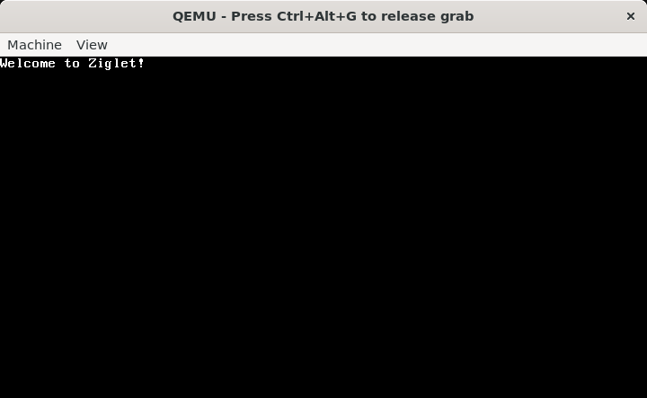

# Ziglet 

## Overview

Ziglet is a toy microkernel that I am developing, inspired by [Minix3](https://www.minix3.org/). My main goal with Ziglet is to learn about low-level programming, operating system concepts, and the Zig programming language. This project serves as a personal exploration into how microkernels operate, and I'm excited to dive deep into the intricacies of kernel development.

## Design Goals

The objectives I'm aiming for with Ziglet include:

1. **Microkernel Architecture:** Create a minimal kernel focused on essential tasks like scheduling, communication, and basic hardware interaction.
   
2. **Learning:** Use Ziglet as hands-on way to understand operating system principles and low-level programming.

3. **Simplicity:** Keep the codebase straightforward and easy to understand, perfect for learning and experimentation.

4. **Modularity:** Design services that can run in user space, allowing for separation between the core kernel functionality and other system services.

## Getting Started

Before you can build and run Ziglet, you'll need:

- [Zig Latest Version](https://ziglang.org/download/) (v0.13.0 or higher)
- [QEMU](https://www.qemu.org/download/)
- [GRUB](https://www.gnu.org/software/grub/grub-download.html)

> **_NOTE:_** Make sure to install `xorriso` before attempting to build the ISO:
```shell
sudo apt install xorriso
```

## Usage

1. Clone the repository:

    ```shell
    git clone https://github.com/ezrantn/ziglet.git
    cd ziglet
    ```

2. Build the kernel:

    ```shell
    zig build
    ```

3. Run with QEMU:
   
    ```shell
    qemu-system-x86_64 -cdrom ziglet.iso -monitor stdio
    ```

You should now see "Welcome to Ziglet!" displayed in the QEMU window.

### Screenshot



## Future Enhancements

This microkernel is still under development, and I am still exploring the following areas:

- Terminal driver implementation
- Memory management
- Interrupt handling
- Process scheduling

## License

This tool is open-source and available under the [MIT](https://github.com/ezrantn/ziglet/blob/main/LICENSE) License.

## Contributions

Contributions are welcome! Please feel free to submit a pull request.